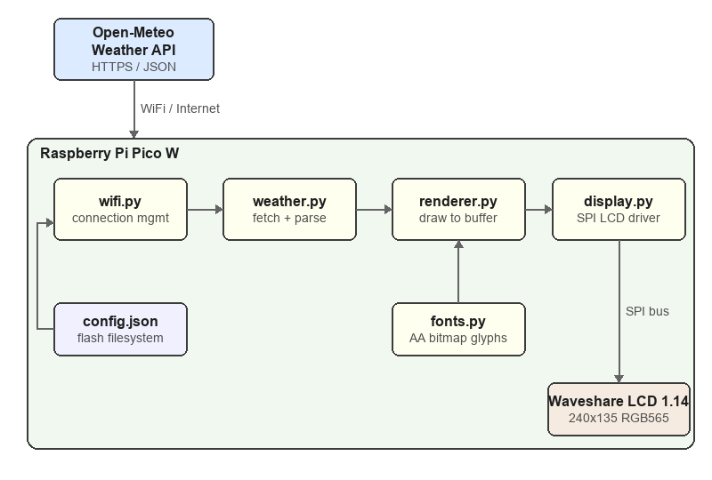

# PicoWeather Standalone - Architecture

**Version**: 0.1 (Pre-development)
**Date**: 2026-03-04
**Status**: Draft

## 1. System Context



## 2. Language and Runtime

**MicroPython** on Raspberry Pi Pico W.

Rationale (vs C with pico-sdk):
- Built-in HTTPS client (`urequests` + `ssl`) avoids integrating mbedTLS
- Built-in JSON parsing (`ujson`) avoids a C JSON library
- Existing proven LCD driver code in MicroPython (`pico-picture.py`)
- `framebuf` module provides drawing primitives (lines, rectangles, text)
- 5-minute update cycle makes execution speed irrelevant
- Faster development iteration (edit file on device, reboot)

## 3. Module Architecture

### 3.1 Module Dependency Diagram

```
main.py
  |
  +-- config.json          (read at startup)
  +-- wifi.py              (WiFi connection management)
  +-- weather.py           (API client + JSON parsing)
  +-- renderer.py          (weather visualization logic)
  +-- fonts.py             (bitmap data for large digits)
  +-- display.py           (hardware abstraction: LCD driver)
```

### 3.2 Module Responsibilities

#### `main.py` - Application Entry Point
- Reads `config.json` for WiFi credentials and location
- Initializes WiFi via `wifi.py`
- Displays startup status on LCD
- Runs the main loop: fetch -> parse -> render -> sleep 5 minutes
- Handles top-level error recovery (WiFi reconnection, fetch retries)

#### `config.json` - Configuration Store
- Stored on Pico's flash filesystem
- Edited by user via USB/Thonny before deployment
- Contents:
  ```json
  {
    "ssid": "NetworkName",
    "password": "NetworkPassword",
    "lat": 30.27,
    "lon": -97.74,
    "country": "US"
  }
  ```

#### `wifi.py` - WiFi Connection Manager
- Connects to configured access point
- Reports connection status (for display on LCD during startup)
- Provides reconnection on disconnect
- Sets regulatory country code

#### `weather.py` - Weather Data Client
- Constructs Open-Meteo API URL from latitude/longitude
- Makes HTTPS GET request
- Parses JSON response into simple Python lists:
  - `temperatures`: list of float (Fahrenheit)
  - `precipitations`: list of float (mm)
  - `now_index`: integer index of the "now" position in the arrays
- **No hardware dependencies** - pure Python, testable on CPython
- Returns a `WeatherData` namedtuple/dict on success, `None` on failure

#### `renderer.py` - Weather Visualization
- Takes `WeatherData` and a display object implementing the HAL interface
- Computes display coordinates, scales, ranges
- Draws all visual elements:
  1. Black background fill
  2. Precipitation bars (cyan, from bottom)
  3. Now marker (gray vertical line)
  4. Temperature trend line (orange)
  5. Current temperature text (large, green, top-left)
  6. Min/max temperature text (small, green, right side)
- **No hardware dependencies** - operates on abstract display interface
- Rendering is done at native 240x135 resolution (no 4x upscale; the
  upscale in the Qt version was for anti-aliasing which `framebuf` doesn't
  support anyway)

#### `fonts.py` - Anti-Aliased Bitmap Font Data
- Generated by `tools/generate_font.py` from Arial Bold TrueType font
- 2-bit depth (4 alpha levels: transparent, 33%, 67%, 100%) for smooth edges
- Large glyphs: 65x84 pixels (digits 0-9, minus sign)
- Small glyphs: 22x28 pixels (digits 0-9, minus sign)
- Data stored as base64-encoded bytes, decoded at module load (~17KB)
- Rendering via `pixel()` with 3 precomputed color intensity levels

#### `display.py` - Hardware Abstraction Layer (Pico)
- Wraps the LCD_1inch14 class from `pico-picture.py`
- Extends `framebuf.FrameBuffer`
- Provides the display interface used by `renderer.py`:
  - `fill(color)` - clear screen
  - `pixel(x, y, color)` - set single pixel
  - `hline(x, y, w, color)` - horizontal line
  - `vline(x, y, h, color)` - vertical line
  - `line(x0, y0, x1, y1, color)` - arbitrary line
  - `rect(x, y, w, h, color)` - rectangle outline
  - `fill_rect(x, y, w, h, color)` - filled rectangle
  - `text(string, x, y, color)` - 8x8 text
  - `show()` - flush buffer to LCD via SPI
  - `rgb565(r, g, b)` - convert RGB888 to RGB565
- Manages backlight PWM
- **This is the only module that imports `machine`, `framebuf`, `Pin`, `SPI`**

## 4. Hardware Abstraction for Testing

### 4.1 Desktop HAL (`hal_desktop.py`)

Not deployed to Pico. Used only during development/testing on a desktop
machine running CPython with Pillow.

```python
from PIL import Image, ImageDraw

class DesktopDisplay:
    WIDTH = 240
    HEIGHT = 135

    def __init__(self):
        self.img = Image.new("RGB", (self.WIDTH, self.HEIGHT), (0, 0, 0))
        self.draw = ImageDraw.Draw(self.img)

    def fill(self, color):
        self.img = Image.new("RGB", (self.WIDTH, self.HEIGHT), color)
        self.draw = ImageDraw.Draw(self.img)

    def pixel(self, x, y, color):
        self.draw.point((x, y), fill=color)

    def line(self, x0, y0, x1, y1, color):
        self.draw.line([(x0, y0), (x1, y1)], fill=color)

    def hline(self, x, y, w, color):
        self.draw.line([(x, y), (x + w - 1, y)], fill=color)

    def vline(self, x, y, h, color):
        self.draw.line([(x, y), (x, y + h - 1)], fill=color)

    def fill_rect(self, x, y, w, h, color):
        self.draw.rectangle([x, y, x + w - 1, y + h - 1], fill=color)

    def text(self, string, x, y, color):
        self.draw.text((x, y), string, fill=color)

    def show(self):
        pass  # No-op on desktop

    def save(self, path="output.png"):
        self.img.save(path)
```

### 4.2 Interface Contract

Both `display.py` (Pico) and `hal_desktop.py` (desktop) implement the same
method signatures. `renderer.py` is written against this interface and works
with either backend.

Key difference: on Pico, colors are RGB565 integers. On desktop, colors are
RGB tuples. The renderer uses a helper to produce the right format:

```python
# In renderer.py
def color(display, r, g, b):
    if hasattr(display, 'rgb565'):
        return display.rgb565(r, g, b)
    return (r, g, b)
```

## 5. Data Flow

### 5.1 Normal Update Cycle

```
1. weather.py: Build URL with lat/lon from config
2. weather.py: HTTPS GET to api.open-meteo.com
3. weather.py: Parse JSON -> WeatherData(temps=[], precips=[], now_index=N)
4. renderer.py: Compute min/max/range, scale coordinates
5. renderer.py: Draw background, rain bars, now line, temp line, text
6. display.py: show() -> SPI write to LCD
7. main.py: sleep 300 seconds
8. Repeat from step 1
```

### 5.2 Error Recovery

```
WiFi disconnect:
  -> wifi.py attempts reconnection (up to 30 seconds)
  -> On success: resume normal cycle
  -> On failure: wait 60 seconds, retry

HTTP/API error:
  -> weather.py returns None
  -> main.py keeps last WeatherData, skips rendering
  -> Retry on next 5-minute cycle

JSON parse error:
  -> weather.py returns None (same as HTTP error)
```

## 6. Memory Budget

| Component | Estimated Bytes |
|-----------|-------------:|
| Framebuffer (240 x 135 x 2) | 64,800 |
| MicroPython runtime overhead | ~60,000 |
| HTTP response buffer (JSON ~4KB) | ~8,000 |
| Parsed weather arrays (52 floats x 2 x 8) | ~832 |
| Font bitmap data (AA 2-bit) | ~17,000 |
| Code modules (.mpy compiled) | ~15,000 |
| Stack + working memory | ~20,000 |
| **Total estimated** | **~170,000** |
| **Available (264KB)** | **270,336** |
| **Margin** | **~100KB** |

JSON response processing is the main concern. The response is read, parsed,
and discarded within `weather.py` before rendering begins. `gc.collect()` is
called between phases.

## 7. File Layout

```
pico-weather/
+-- REQUIREMENTS.md       # This project's requirements
+-- ARCHITECTURE.md       # This document
+-- pico/                 # Files deployed to the Pico W
|   +-- main.py           # Entry point
|   +-- config.json       # User configuration (not in git)
|   +-- config_example.json  # Template for config.json
|   +-- wifi.py           # WiFi management
|   +-- weather.py        # API client + parsing
|   +-- renderer.py       # Visualization rendering
|   +-- display.py        # LCD hardware driver
|   +-- fonts.py          # Large digit bitmaps
+-- tests/                # Desktop-only test files
|   +-- hal_desktop.py    # Pillow-based display for testing
|   +-- test_weather.py   # Unit tests for weather parsing
|   +-- test_renderer.py  # Rendering tests (produces PNGs)
|   +-- test_integration.py  # Live API + render end-to-end
|   +-- sample_response.json # Captured API response for offline tests
|   +-- requirements.txt  # CPython test dependencies (Pillow, etc.)
+-- tools/                # Development utilities (not deployed)
|   +-- generate_font.py  # Generates fonts.py from TrueType font
```

## 8. Development Phases

### Phase 1: Weather Data Client (COMPLETE)
Built `weather.py` with URL construction, JSON parsing, range computation,
and dual-runtime fetch (urequests on MicroPython, urllib on CPython).
10 unit tests and 1 live integration test passing. Network errors handled
gracefully (returns None). Array length mismatches truncated safely.

### Phase 2: Display Rendering (COMPLETE)
Built `renderer.py`, `fonts.py`, `tests/hal_desktop.py`. 5x7 bitmap digits
with scalable rendering. Color abstraction via `color()` helper. Y-coordinate
clamping for robustness. 5 render tests + 2 integration tests passing.

### Phase 3: Integration and Main Loop (COMPLETE)
Built `main.py`, `wifi.py`, `display.py`. Config loading from JSON, WiFi
connection with status callbacks, main loop with gc.collect(), last-good-data
fallback. 3 rgb565 tests verified against Qt pixTrans. 20 total tests passing.

### Phase 4: Robustness and Polish (COMPLETE)
WiFi retry loop with backoff (5 attempts), stale-data indicator, consecutive
failure tracking, top-level exception handler, memory budget test (111KB of
210KB, 47% margin). 22 total tests across 5 suites passing.

## 9. Key Design Decisions

| Decision | Rationale |
|----------|-----------|
| MicroPython over C | HTTPS + JSON built-in; existing LCD driver; adequate performance |
| Open-Meteo over Meteomatics | Free, keyless, stable, adequate resolution |
| No 4x upscale rendering | `framebuf` has no anti-aliasing; native resolution is sufficient |
| File-based config over WiFi AP setup | Simpler; user already has USB access via Thonny |
| Separate HAL module | Enables full test coverage on desktop without hardware |
| `minutely_15` with `hourly` fallback | Best resolution available; graceful degradation |
